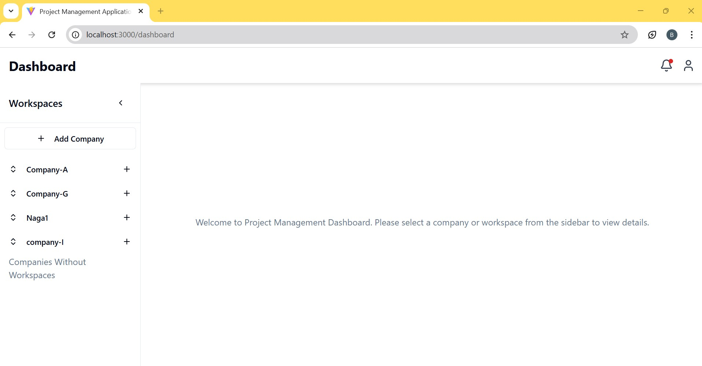
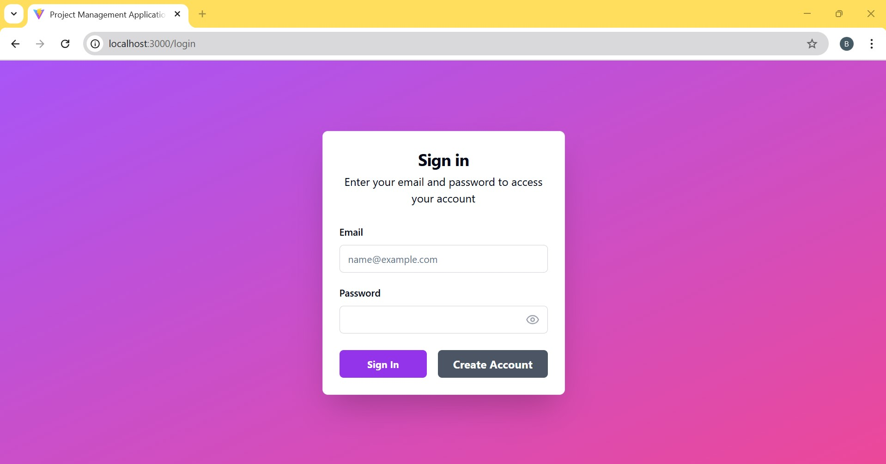
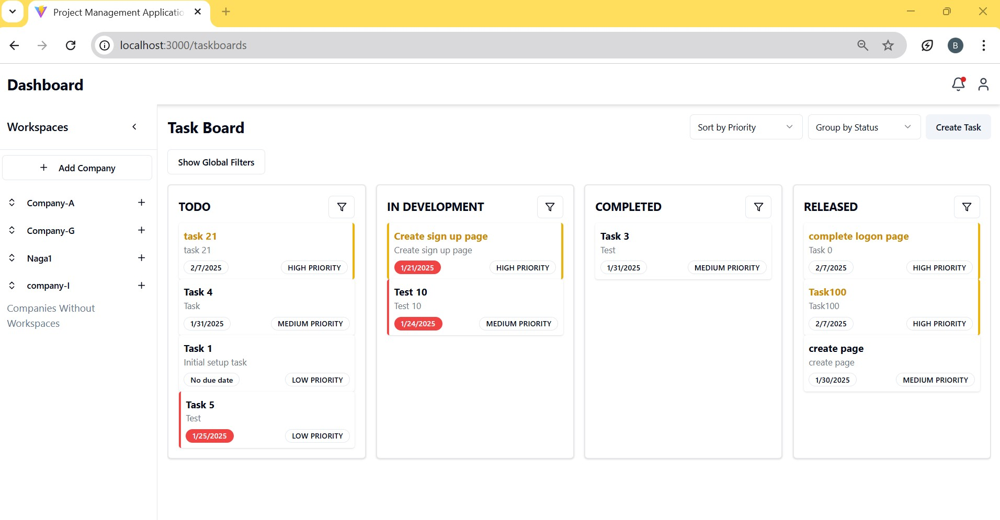

# Frontend Project

This is a React-based frontend project designed with modern tools and frameworks. The application incorporates various features like authentication, task management, real-time notifications, permission handling, and more, making it suitable for scalable and complex web applications.

Refer to the [Backend Link](https://github.com/nagadheerajb/Project_Management_Backend)

---

## Table of Contents

1. [Features](#features)
2. [Project Structure](#project-structure)
3. [Installation](#installation)
4. [Usage Instructions](#usage-instructions)
5. [Core Application Workflow](#core-application-workflow)
6. [API Documentation](#api-documentation)
7. [Component Highlights](#component-highlights)
8. [Custom Hooks](#custom-hooks)
9. [Context Management](#context-management)
10. [Screenshots](#screenshots)
11. [Development Workflow](#development-workflow)
12. [Future Scope](#future-scope)
13. [Contributing](#contributing)
14. [License](#license)
15. [Contact](#contact)

---

## Features

- **Authentication**: Secure login and sign-up forms with validation.
- **Task Management**: Intuitive drag-and-drop task board for organizing projects.
- **Role-Based Access Control**: Manage roles, permissions, and access levels.
- **Real-Time Notifications**: Stay updated with live notifications for task updates and system events.
- **Responsive Design**: Optimized for mobile and desktop views.
- **Customizable Components**: Built using reusable UI components.
- **State Management**: Context API for managing user and workspace state.
- **Dynamic Sidebar**: Interactive and personalized sidebar with company and workspace management.

---

## Project Structure

```
frontend_project
├── components.json               # Component metadata
├── package.json                  # Project dependencies and scripts
├── tailwind.config.js            # Tailwind CSS configuration
├── tsconfig.json                 # TypeScript configuration
├── tsconfig.node.json            # Node-specific TypeScript configuration
├── vite.config.ts                # Vite configuration
├── yarn.lock                     # Yarn lock file
├── src                           # Source files
│   ├── api                       # API services for backend integration
│   ├── components                # UI components and forms
│   ├── context                   # Global context providers
│   ├── hooks                     # Custom React hooks
│   ├── pages                     # Page components
│   ├── styles                    # Global styles
│   ├── types                     # TypeScript interfaces and types
│   └── utils                     # Utility functions
```

---

## Installation

### Prerequisites

- Node.js (>= 14.x)
- Yarn (>= 1.22.x)

### Steps

1. Clone the repository:
   ```bash
   git clone https://github.com/nagadheerajb/fs19_frontend.git
   cd your-repo-name
   ```
2. Install dependencies:
   ```bash
   yarn install
   ```
3. Start the development server:
   ```bash
   yarn dev
   ```
4. Open the app in your browser at `http://localhost:3000`.

---

## Usage Instructions

### Example Workflows

- **Adding a Task**:

  1. Navigate to the Task Board page.
  2. Click the "Create Task" button.
  3. Fill in the task details and assign it to a user.
  4. Click "Submit" to save.

- **Managing Roles**:

  1. Go to the Role Management page.
  2. Create a new role or edit an existing one.
  3. Assign permissions and save changes.

- **Receiving Notifications**:

  1. Perform an action like adding a task or updating a role.
  2. Observe the real-time notification popup in the application header.

- **Using the Sidebar**:
  1. Navigate through dynamic links for different sections.
  2. Add a new company or workspace using the "Add" button with a modal form.
  3. View updates in real-time as changes are made.

---

## Core Application Workflow

### User Journey:

1. **Sign Up for the Application**:

   - Users can register with their details to create an account.

2. **Log In to the Application**:

   - After registering, users can securely log in to their account.

3. **Create a New Company**:

   - Users can create a new company to group related projects and workspaces.

4. **Set Up a Workspace**:

   - Within a company, users can create workspaces to organize their projects.

5. **Create Projects Under the Workspace**:

   - Users can define specific projects within a workspace.

6. **View and Create Tasks**:

   - Navigate to the task board to view tasks.
   - Create new tasks and assign them to users.

7. **Assign Tasks to Users**:

   - Users can assign tasks to other team members, ensuring collaboration.

8. **Comment Under Tasks**:

   - Add comments to tasks for effective communication and tracking.

9. **Receive Real-Time Notifications**:

   - Users are notified instantly of updates like task assignments or new comments.

10. **Promote and Demote Tasks**:
    - Tasks can be prioritized or reprioritized to reflect their importance.

---

## API Documentation

Key API services in the project:

- **Authentication**:

  - `auth.ts`: Handles login and signup operations.

- **Tasks**:

  - `task.ts`: API operations for fetching, creating, and managing tasks.

- **Roles and Permissions**:

  - `role.ts`: Manage user roles.
  - `permission.ts`: Handle permission-related API calls.
  - `rolepermission.ts`: Manage relationships between roles and permissions.

- **Notifications**:

  - `notification.ts`: Fetch and manage real-time notifications.

- **Company Management**:

  - `company.ts`: Handles company-related data operations.

- **Workspace Management**:
  - `workspace.ts`: Manage workspaces.

---

## Component Highlights

### Common Components

- **Reusable Inputs**: Components like `email-input.tsx`, `password-input.tsx`, and `first-name-input.tsx` simplify form creation.
- **Modal Form**: `modal-form.tsx` and `ModalFormHandler.tsx` allow dynamic form rendering within modals.
- **Protected Routes**: `protected-route.tsx` ensures secure navigation for authenticated users.

### Dashboard Components

- **Dashboard Content**: `dashboard-content.tsx` serves as the main container for displaying user and project data.
- **Details Management**: Components like `company-details.tsx` and `workspace-details.tsx` handle the display and editing of entity details.
- **Collapsible Projects**: `ProjectCollapsible.tsx` organizes projects in expandable sections.

### Login and Sign-Up Forms

- **Login Form**: `login-form.tsx` with modular components for header, body, and footer.
- **Sign-Up Form**: `sign-up-form.tsx` with similar modularity and validation.

### Task Board Components

- **Task Board**: `TaskBoardContent.tsx` with drag-and-drop task management.
- **Task Dialog**: `TaskDialog.tsx` provides a modal for editing task details.
- **User Search**: `UserSearch.tsx` facilitates assigning tasks to users.

### Sidebar

- **Dynamic Navigation**: `Side-bar.tsx` with `SidebarNav.tsx` for rendering links.
- **Action Buttons**: Add companies and workspaces with `SidebarButton.tsx`.

### Permission and Role Management

- **Permission Management**: `PermissionManagementContent.tsx` for handling access controls.
- **Role Management**: `RoleManagementContent.tsx` and `RolePermissionManagementContent.tsx` for defining and assigning roles and permissions.

---

## Custom Hooks

- **Authentication**:

  - `useLoginMutation.ts`: Handle login logic.
  - `useSignUpMutation.ts`: Simplify user registration processes.

- **Data Fetching**:

  - `useFetchUser.ts`: Fetch the current logged-in user's data.
  - `useNotifications.ts`: Manage real-time notifications.
  - `useTasks.ts`: Fetch and manage task data.

- **Mutations**:

  - `useCommentMutations.ts`: Handle comment-related actions.
  - `useCompanyMutations.ts`: Manage company data operations.
  - `useWorkspaceMutations.ts`: Handle workspace creation and updates.

- **Permission Handling**:
  - `usePermissions.ts`: Check and manage user permissions.
  - `useRolePermissions.ts`: Fetch and manage role-permission relationships.

---

## Context Management

- **Global State Management**:
  - `user-context.tsx`: Provides global user data and actions.
  - `workspace-context.tsx`: Manages workspace state and operations.

---

## Screenshots

### Dashboard



### Login Page



### Task Board



---

## Development Workflow

1. **Setting Up**:

   - Follow the installation steps above.

2. **Debugging**:
   - Use the browser developer tools.
   - Check logs for errors in the console.

---

## Future Scope

- Add unit and integration tests.
- Improve accessibility features.
- Integrate advanced analytics.
- Expand role and permission customizations.
- Enhance notification settings and controls.
- Implement advanced sidebar features like collapsible groups and drag-and-drop reordering.

---

## Contributing

Contributions are welcome! Follow these steps:

1. Fork the repository.
2. Create a new branch:
   ```bash
   git checkout -b feature-name
   ```
3. Commit your changes:
   ```bash
   git commit -m "Add feature-name"
   ```
4. Push to your branch:
   ```bash
   git push origin feature-name
   ```
5. Open a pull request.

---

## License

This project is licensed under the [MIT License](LICENSE).

---

## Contact

For inquiries or support, please email [nagadheerajb@gmail.com](mailto:nagadheerajb@gmail.com).
